---

# 📦 maatify/data-adapters
**Unified Data Connectivity & Diagnostics Layer**

[](https://packagist.org/packages/maatify/data-adapters)
[](https://packagist.org/packages/maatify/data-adapters)
[](https://github.com/Maatify/data-adapters/actions/workflows/test.yml)
[](https://packagist.org/packages/maatify/data-adapters)
[](https://packagist.org/packages/maatify/data-adapters)
[](https://github.com/Maatify/data-adapters/stargazers)
[](LICENSE)
[]()
[](https://www.codefactor.io/repository/github/Maatify/data-adapters)

---

## 🧭 Overview
**maatify/data-adapters** provides a unified and extensible layer for managing connections  
to multiple data sources — Redis, MongoDB, and MySQL — with built-in diagnostics,  
fallback recovery, and environment auto-detection.  
It acts as the foundational data layer for the entire **Maatify Ecosystem**.

---

## ⚙️ Installation

```bash
composer require maatify/data-adapters
````

> Requires PHP ≥ 8.1 and extensions for `redis`, `pdo_mysql`, `mongodb` (optional).

---

## 🚀 Quick Usage

```php
use Maatify\DataAdapters\Core\EnvironmentConfig;
use Maatify\DataAdapters\Core\DatabaseResolver;
use Maatify\DataAdapters\Enums\AdapterTypeEnum;

$config   = new EnvironmentConfig(__DIR__);
$resolver = new DatabaseResolver($config);

// Redis Adapter
$redis = $resolver->resolve(AdapterTypeEnum::REDIS);
$redis->connect();

// MySQL Adapter
$mysql = $resolver->resolve(AdapterTypeEnum::MYSQL);
$pdo   = $mysql->getConnection();
```

---

## 🧩 Diagnostics & Health Checks

All adapters include self-diagnostic capabilities and unified health reporting.

```php
use Maatify\DataAdapters\Diagnostics\DiagnosticService;

$diagnostic = new DiagnosticService($config, $resolver);
echo $diagnostic->toJson();
```

**Example Output**

```json
{
  "diagnostics": [
    {"adapter": "redis", "connected": true},
    {"adapter": "mongo", "connected": true},
    {"adapter": "mysql", "connected": true}
  ]
}
```

---

## 💾 Fallback & Recovery System

When a primary adapter fails (e.g., Redis or MySQL),
the system automatically switches to a fallback driver (Predis, SQLite, etc.),
queues failed operations, and replays them once the connection recovers.

**Example .env**

```env
REDIS_PRIMARY_HOST=127.0.0.1
REDIS_FALLBACK_DRIVER=predis
FALLBACK_QUEUE_TTL=3600
ADAPTER_LOG_PATH=/var/logs/maatify/adapters/
```

---

## 🧠 Intelligent Queue Pruning

Expired fallback operations are pruned automatically
every 10 recovery cycles using `FallbackQueuePruner`,
ensuring memory stability during long runtimes.

```php
(new FallbackQueuePruner($_ENV['FALLBACK_QUEUE_TTL'] ?? 3600))->run();
```

---

## 🧱 Architecture Overview

```
src/
├─ Core/
│   ├─ EnvironmentConfig.php
│   ├─ DatabaseResolver.php
│   └─ BaseAdapter.php
├─ Adapters/
│   ├─ RedisAdapter.php
│   ├─ PredisAdapter.php
│   ├─ MongoAdapter.php
│   ├─ MySQLAdapter.php
│   └─ MySQLDbalAdapter.php
├─ Diagnostics/
│   ├─ DiagnosticService.php
│   ├─ AdapterFailoverLog.php
│   └─ Logger/
│       ├─ FileAdapterLogger.php
│       └─ Contracts/AdapterLoggerInterface.php
└─ Fallback/
    ├─ FallbackQueue.php
    ├─ FallbackManager.php
    ├─ FallbackQueuePruner.php
    └─ RecoveryWorker.php
```

---

## 🧩 Environment Variables

| Variable                | Description                    |
|:------------------------|:-------------------------------|
| `REDIS_PRIMARY_HOST`    | Redis primary host             |
| `REDIS_FALLBACK_DRIVER` | Fallback driver (e.g., predis) |
| `MYSQL_DSN`             | MySQL DSN connection string    |
| `MONGO_URI`             | MongoDB URI connection         |
| `ADAPTER_LOG_PATH`      | Path for failover logs         |
| `FALLBACK_QUEUE_TTL`    | Queue retention (seconds)      |

---

## 🧪 Testing

```bash
vendor/bin/phpunit
```

**Coverage:** > 87 %
**Status:** ✅ All tests passing (integration, diagnostics, fallback)

---

### 🔄 Redis Fallback & Recovery System

The **fallback mechanism** in `maatify/data-adapters` currently applies **only to Redis connections**.  
It ensures continuous operation even if the primary Redis server (via `phpredis`) becomes unreachable.

---

#### ⚙️ Redis Failover Flow

```mermaid
flowchart TD
    A[Client Request] --> B[RedisAdapter : phpredis]
    B -->|✅ Connected| Z[Command Executed]
    B -->|❌ Failure| C[handleFailure]
    C --> D[FallbackManager::activatePredis]
    D --> E[PredisAdapter : fallback]
    E -->|Reconnect| F[Resume Operations]
    F --> G[RecoveryWorker Monitors Health]
    G -->|Redis Restored| H[Replay Queued Ops from FallbackQueue]
    H --> I[Pruner Clears Expired Entries]
    I --> Z
```



---

#### 🧩 Key Components (Redis only)

| Component                                  | Description                                                  |
|:-------------------------------------------|:-------------------------------------------------------------|
| **RedisAdapter**                           | Primary adapter using `phpredis` extension                   |
| **PredisAdapter**                          | Secondary adapter (PHP fallback)                             |
| **FallbackManager**                        | Switches between primary and fallback adapters               |
| **FallbackQueue**                          | Stores failed Redis operations for later replay              |
| **RecoveryWorker**                         | Replays queued operations once Redis reconnects              |
| **FallbackQueuePruner**                    | Removes expired queued items periodically                    |
| **AdapterFailoverLog / FileAdapterLogger** | Logs fallback activation, reconnection, and recovery results |

---

#### 🧠 Example `.env`

```env
REDIS_PRIMARY_HOST=127.0.0.1
REDIS_PRIMARY_PORT=6379
REDIS_FALLBACK_DRIVER=predis
REDIS_RETRY_SECONDS=10
FALLBACK_QUEUE_TTL=3600
ADAPTER_LOG_PATH=/var/logs/maatify/adapters/
```

---

#### 💡 Usage Example

```php
use Maatify\DataAdapters\Core\EnvironmentConfig;
use Maatify\DataAdapters\Core\DatabaseResolver;
use Maatify\DataAdapters\Enums\AdapterTypeEnum;
use Maatify\DataAdapters\Core\Exceptions\ConnectionException;

$config   = new EnvironmentConfig(__DIR__);
$resolver = new DatabaseResolver($config);
$redis    = $resolver->resolve(AdapterTypeEnum::REDIS);

try {
    $redis->connect();
    $redis->set('session:123', 'active');
} catch (ConnectionException $e) {
    // Automatically falls back to PredisAdapter
    echo "⚠️ Redis fallback engaged: {$e->getMessage()}";
}
```

---

#### 🧾 Automatic Recovery

Once the primary Redis server becomes available again,
the **RecoveryWorker** replays all queued operations and prunes expired ones.

```php
use Maatify\DataAdapters\Fallback\RecoveryWorker;
use Maatify\DataAdapters\Fallback\FallbackQueuePruner;

$worker = new RecoveryWorker($redis);
$worker->run(); // retries queued ops and clears expired ones
```

🧹 `FallbackQueuePruner` runs every 10 cycles automatically to clean expired entries.

---

#### 📊 Behavior Summary

| Event                           | Response                                   |
|:--------------------------------|:-------------------------------------------|
| `phpredis` connection fails     | Switches automatically to `PredisAdapter`  |
| Operation fails during fallback | Added to `FallbackQueue`                   |
| Redis connection restored       | `RecoveryWorker` replays queued operations |
| Expired queue entries           | Cleaned by `FallbackQueuePruner`           |
| All transitions                 | Logged via `AdapterFailoverLog`            |

---

#### 🔍 Scope Limitation

> 🧱 Currently, fallback logic applies **only to RedisAdapter**
> MySQL and MongoDB adapters rely on **diagnostic self-checks only** (no fallback queue or replay).
> Cross-adapter fallback may be added in future versions (Phase 7).

---

#### 🧠 Example Log Output

```
[2025-11-11 17:42:02] [REDIS] Connection timeout – switching to PredisAdapter
[2025-11-11 17:42:03] [REDIS] Fallback active – operations queued
[2025-11-11 17:45:18] [REDIS] Primary reconnected – replaying 12 queued ops
[2025-11-11 17:45:19] [REDIS] Queue pruned (TTL=3600s)
```

---

🧩 This Redis-only fallback architecture provides **graceful degradation** and **automatic recovery**
without manual intervention — fully transparent to the consuming application.

---

### 🔗 Integration with maatify/bootstrap

The **maatify/data-adapters** library is fully compatible with  
[`maatify/bootstrap`](https://github.com/Maatify/bootstrap),  
which handles automatic initialization and dependency injection  
of all registered adapters via the shared `Container` instance.

---

#### ⚙️ Auto-Registration

Once `maatify/bootstrap` is installed,  
the adapters are automatically registered during the bootstrap phase:

```php
use Maatify\Bootstrap\Bootstrap;
use Maatify\DataAdapters\Core\DatabaseResolver;
use Maatify\DataAdapters\Core\EnvironmentConfig;

$bootstrap = new Bootstrap();
$container = $bootstrap->container();

// Resolve adapters anywhere in the system:
$config   = $container->get(EnvironmentConfig::class);
$resolver = $container->get(DatabaseResolver::class);
$redis    = $resolver->resolve('redis');
````

No manual setup required — `.env` variables are loaded globally by `maatify/bootstrap`,
and all diagnostics, failover, and recovery mechanisms are instantly available.

---

#### 🧩 Use within Other Maatify Modules

| Module                      | Integration                                                      |
|:----------------------------|:-----------------------------------------------------------------|
| **maatify/rate-limiter**    | Uses `RedisAdapter` with fallback for request limiting           |
| **maatify/security-guard**  | Connects via `MySQLAdapter` for credential checks                |
| **maatify/mongo-activity**  | Uses `MongoAdapter` for structured event logging                 |
| **maatify/common-security** | Reads adapters through the shared container                      |
| **maatify/psr-logger**      | Injects `FileAdapterLogger` or PSR-based logger for adapter logs |

---

#### 🧠 Unified Configuration Flow

All connection parameters are managed from a single `.env` file shared across projects:

```env
REDIS_PRIMARY_HOST=127.0.0.1
REDIS_FALLBACK_DRIVER=predis
MYSQL_DSN=mysql:host=127.0.0.1;dbname=maatify
MONGO_URI=mongodb://127.0.0.1:27017
ADAPTER_LOG_PATH=/var/logs/maatify/adapters/
```

Any library within the Maatify ecosystem can simply request a database connection
through the container — **no duplicate setup or credentials required.**

---

🧱 **maatify/data-adapters** therefore acts as the *central data layer*
linking Redis, MySQL, and MongoDB connectivity with unified diagnostics,
and automatic Redis failover across the entire **Maatify.dev** ecosystem.

---


## 🧭 Development Roadmap

| Phase | Title                                 | Status      |
|:------|:--------------------------------------|:------------|
| 1     | Environment Setup                     | ✅ Completed |
| 2     | Core Interfaces & Base Structure      | ✅ Completed |
| 3     | Adapter Implementations               | ✅ Completed |
| 3.5   | Adapter Smoke Tests                   | ✅ Completed |
| 4     | Health & Diagnostics Layer            | ✅ Completed |
| 4.1   | Hybrid AdapterFailoverLog Enhancement | ✅ Completed |
| 4.2   | Adapter Logger Abstraction via DI     | ✅ Completed |
| 5     | Integration & Unified Testing         | ✅ Completed |
| 6     | Fallback Intelligence & Recovery      | ✅ Completed |
| 6.1   | Queue Pruner & TTL Management         | ✅ Completed |
| 6.1.1 | RecoveryWorker ↔ Pruner Sync          | ✅ Completed |
| 7     | Persistent Failover & Telemetry       | 🟡 Planned  |
| 8     | Observability, Metrics & Docs         | 🟡 Pending  |

---

## 🔗 Related Maatify Libraries

* [maatify/common](https://github.com/Maatify/common)
* [maatify/psr-logger](https://github.com/Maatify/psr-logger)
* [maatify/bootstrap](https://github.com/Maatify/bootstrap)
* [maatify/rate-limiter](https://github.com/Maatify/rate-limiter)
* [maatify/security-guard](https://github.com/Maatify/security-guard)
* [maatify/mongo-activity](https://github.com/Maatify/mongo-activity)

---


## 🪪 License

**[MIT license](LICENSE)** © [Maatify.dev](https://www.maatify.dev)  
You’re free to use, modify, and distribute this library with attribution.

---
> 🔗 **Full documentation & release notes:** see [/docs/README.full.md](docs/README.full.md)
---

## 🧱 Authors & Credits

This library is part of the **Maatify.dev Core Ecosystem**, designed and maintained under the technical supervision of:

**👤 Mohamed Abdulalim** — *Backend Lead & Technical Architect*  
Lead architect of the **Maatify Backend Infrastructure**, responsible for the overall architecture, core library design,  
and technical standardization across all backend modules within the Maatify ecosystem.  
🔗 [www.Maatify.dev](https://www.maatify.dev) | ✉️ [mohamed@maatify.dev](mailto:mohamed@maatify.dev)

**🤝 Contributors:**  
The **Maatify.dev Engineering Team** and open-source collaborators who continuously help refine, test, and extend  
the capabilities of this library across multiple Maatify projects.

> 🧩 This project represents a unified engineering effort led by Mohamed Abdulalim, ensuring every Maatify backend component  
> shares a consistent, secure, and maintainable foundation.

