---

# 📦 maatify/data-adapters
**Unified Data Connectivity & Diagnostics Layer**

[](https://packagist.org/packages/maatify/data-adapters)
[](https://packagist.org/packages/maatify/data-adapters)
[](https://github.com/Maatify/data-adapters/actions/workflows/test.yml)
[](https://packagist.org/packages/maatify/data-adapters)
[](https://packagist.org/packages/maatify/data-adapters)
[](https://github.com/Maatify/data-adapters/stargazers)
[](LICENSE)
[]()
[](https://www.codefactor.io/repository/github/Maatify/data-adapters)

[](CHANGELOG.md)
[](SECURITY.md)

---
## 🧭 Overview
**maatify/data-adapters** provides a unified and extensible layer for managing connections  
to multiple data sources — Redis, MongoDB, and MySQL — with built-in diagnostics,  
fallback recovery, and environment auto-detection.  
It acts as the foundational data layer for the entire **Maatify Ecosystem**.

---

## ⚙️ Installation

```bash
composer require maatify/data-adapters
```

> Requires PHP ≥ 8.1 and extensions for `redis`, `pdo_mysql`, `mongodb` (optional).

---

## 🚀 Quick Usage

```php
use Maatify\DataAdapters\Core\EnvironmentConfig;
use Maatify\DataAdapters\Core\DatabaseResolver;
use Maatify\DataAdapters\Enums\AdapterTypeEnum;

$config   = new EnvironmentConfig(__DIR__);
$resolver = new DatabaseResolver($config);

// Redis Adapter
$redis = $resolver->resolve(AdapterTypeEnum::REDIS);
$redis->connect();

// MySQL Adapter
$mysql = $resolver->resolve(AdapterTypeEnum::MYSQL);
$pdo   = $mysql->getConnection();
```

---

## 🧩 Diagnostics & Health Checks

All adapters include self-diagnostic capabilities and unified health reporting.

```php
use Maatify\DataAdapters\Diagnostics\DiagnosticService;

$diagnostic = new DiagnosticService($config, $resolver);
echo $diagnostic->toJson();
```

**Example Output**

```json
{
  "diagnostics": [
    {"adapter": "redis", "connected": true},
    {"adapter": "mongo", "connected": true},
    {"adapter": "mysql", "connected": true}
  ]
}
```

---

## 💾 Fallback & Recovery System

When a primary adapter fails (e.g., Redis or MySQL),
the system automatically switches to a fallback driver (Predis, SQLite, etc.),
queues failed operations, and replays them once the connection recovers.

**Example .env**

```env
REDIS_PRIMARY_HOST=127.0.0.1
REDIS_FALLBACK_DRIVER=predis
FALLBACK_QUEUE_TTL=3600
ADAPTER_LOG_PATH=/var/logs/maatify/adapters/
```

---

## 🧠 Intelligent Queue Pruning

Expired fallback operations are pruned automatically
every 10 recovery cycles using `FallbackQueuePruner`,
ensuring memory stability during long runtimes.

```php
(new FallbackQueuePruner($_ENV['FALLBACK_QUEUE_TTL'] ?? 3600))->run();
```

---

## 🧱 Architecture Overview

```
src/
├─ Core/
│   ├─ EnvironmentConfig.php
│   ├─ DatabaseResolver.php
│   └─ BaseAdapter.php
├─ Adapters/
│   ├─ RedisAdapter.php
│   ├─ PredisAdapter.php
│   ├─ MongoAdapter.php
│   ├─ MySQLAdapter.php
│   └─ MySQLDbalAdapter.php
├─ Diagnostics/
│   ├─ DiagnosticService.php
│   ├─ AdapterFailoverLog.php
│   └─ Logger/
│       ├─ FileAdapterLogger.php
│       └─ Contracts/AdapterLoggerInterface.php
└─ Fallback/
    ├─ FallbackQueue.php
    ├─ FallbackManager.php
    ├─ FallbackQueuePruner.php
    └─ RecoveryWorker.php
```

---

## 🧩 Environment Variables

| Variable                | Description                    |
|:------------------------|:-------------------------------|
| `REDIS_PRIMARY_HOST`    | Redis primary host             |
| `REDIS_FALLBACK_DRIVER` | Fallback driver (e.g., predis) |
| `MYSQL_DSN`             | MySQL DSN connection string    |
| `MONGO_URI`             | MongoDB URI connection         |
| `ADAPTER_LOG_PATH`      | Path for failover logs         |
| `FALLBACK_QUEUE_TTL`    | Queue retention (seconds)      |

---

## 🧪 Testing

```bash
vendor/bin/phpunit
```

**Coverage:** > 87 %  
**Status:** ✅ All tests passing (integration, diagnostics, fallback)

---

### 🔄 Redis Fallback & Recovery System

The **fallback mechanism** in `maatify/data-adapters` currently applies **only to Redis connections**.  
It ensures continuous operation even if the primary Redis server (via `phpredis`) becomes unreachable.

---

#### ⚙️ Redis Failover Flow

```mermaid
flowchart TD
    A[Client Request] --> B[RedisAdapter : phpredis]
    B -->|✅ Connected| Z[Command Executed]
    B -->|❌ Failure| C[handleFailure]
    C --> D[FallbackManager::activatePredis]
    D --> E[PredisAdapter : fallback]
    E -->|Reconnect| F[Resume Operations]
    F --> G[RecoveryWorker Monitors Health]
    G -->|Redis Restored| H[Replay Queued Ops from FallbackQueue]
    H --> I[Pruner Clears Expired Entries]
    I --> Z
```



---

#### 🧩 Key Components (Redis only)

| Component                                  | Description                                                  |
|:-------------------------------------------|:-------------------------------------------------------------|
| **RedisAdapter**                           | Primary adapter using `phpredis` extension                   |
| **PredisAdapter**                          | Secondary adapter (PHP fallback)                             |
| **FallbackManager**                        | Switches between primary and fallback adapters               |
| **FallbackQueue**                          | Stores failed Redis operations for later replay              |
| **RecoveryWorker**                         | Replays queued operations once Redis reconnects              |
| **FallbackQueuePruner**                    | Removes expired queued items periodically                    |
| **AdapterFailoverLog / FileAdapterLogger** | Logs fallback activation, reconnection, and recovery results |

---

#### 🧠 Example `.env`

```env
REDIS_PRIMARY_HOST=127.0.0.1
REDIS_PRIMARY_PORT=6379
REDIS_FALLBACK_DRIVER=predis
REDIS_RETRY_SECONDS=10
FALLBACK_QUEUE_TTL=3600
ADAPTER_LOG_PATH=/var/logs/maatify/adapters/
```

---

#### 💡 Usage Example

```php
use Maatify\DataAdapters\Core\EnvironmentConfig;
use Maatify\DataAdapters\Core\DatabaseResolver;
use Maatify\DataAdapters\Enums\AdapterTypeEnum;
use Maatify\DataAdapters\Core\Exceptions\ConnectionException;

$config   = new EnvironmentConfig(__DIR__);
$resolver = new DatabaseResolver($config);
$redis    = $resolver->resolve(AdapterTypeEnum::REDIS);

try {
    $redis->connect();
    $redis->set('session:123', 'active');
} catch (ConnectionException $e) {
    // Automatically falls back to PredisAdapter
    echo "⚠️ Redis fallback engaged: {$e->getMessage()}";
}
```

---

#### 🧾 Automatic Recovery

Once the primary Redis server becomes available again,
the **RecoveryWorker** replays all queued operations and prunes expired ones.

```php
use Maatify\DataAdapters\Fallback\RecoveryWorker;
use Maatify\DataAdapters\Fallback\FallbackQueuePruner;

$worker = new RecoveryWorker($redis);
$worker->run(); // retries queued ops and clears expired ones
```

🧹 `FallbackQueuePruner` runs every 10 cycles automatically to clean expired entries.

---

#### 📊 Behavior Summary

| Event                           | Response                                   |
|:--------------------------------|:-------------------------------------------|
| `phpredis` connection fails     | Switches automatically to `PredisAdapter`  |
| Operation fails during fallback | Added to `FallbackQueue`                   |
| Redis connection restored       | `RecoveryWorker` replays queued operations |
| Expired queue entries           | Cleaned by `FallbackQueuePruner`           |
| All transitions                 | Logged via `AdapterFailoverLog`            |

---

#### 🔍 Scope Limitation

> 🧱 Currently, fallback logic applies **only to RedisAdapter**
> MySQL and MongoDB adapters rely on **diagnostic self-checks only** (no fallback queue or replay).
> Cross-adapter fallback may be added in future versions (Phase 7).

---

#### 🧠 Example Log Output

```
[2025-11-11 17:42:02] [REDIS] Connection timeout – switching to PredisAdapter
[2025-11-11 17:42:03] [REDIS] Fallback active – operations queued
[2025-11-11 17:45:18] [REDIS] Primary reconnected – replaying 12 queued ops
[2025-11-11 17:45:19] [REDIS] Queue pruned (TTL=3600s)
```

---

🧩 This Redis-only fallback architecture provides **graceful degradation** and **automatic recovery**
without manual intervention — fully transparent to the consuming application.

---

## 📈 Observability & Metrics

Starting from **Phase 7**, `maatify/data-adapters` introduces a full **telemetry and metrics layer**  
for real-time monitoring and performance analytics across all adapters  
(**Redis**, **MongoDB**, **MySQL**).

### ⚙️ Core Features
| Feature                        | Description                                                                                             |
|:-------------------------------|:--------------------------------------------------------------------------------------------------------|
| **AdapterMetricsCollector**    | Collects latency, success, and failover counters at runtime.                                            |
| **AdapterMetricsMiddleware**   | Wraps adapter operations and automatically measures execution time.                                     |
| **PrometheusMetricsFormatter** | Exports metrics in Prometheus-compatible text format for dashboards.                                    |
| **PSR-Logger Integration**     | Routes latency and failover logs through [`maatify/psr-logger`](https://github.com/Maatify/psr-logger). |
| **Grafana Ready**              | Metrics can be visualized directly in Grafana or maatify/admin-dashboard.                               |

### 🧩 Example Usage
```php
use Maatify\DataAdapters\Telemetry\{
    AdapterMetricsCollector,
    PrometheusMetricsFormatter
};

$collector = AdapterMetricsCollector::instance();

// Record metrics after any adapter operation
$collector->record('redis', 'set', latencyMs: 2.15, success: true);

// Render Prometheus output
$formatter = new PrometheusMetricsFormatter($collector);
header('Content-Type: text/plain');
echo $formatter->render();
```

**Prometheus Output Example**

```
# HELP adapter_latency_avg Average adapter latency (ms)
# TYPE adapter_latency_avg gauge
adapter_latency_avg{adapter="redis"} 2.15
adapter_success_total{adapter="redis"} 1
adapter_fail_total{adapter="redis"} 0
```

### 📘 .env Configuration

```env
METRICS_ENABLED=true
METRICS_EXPORT_FORMAT=prometheus
METRICS_SAMPLING_RATE=1.0
ADAPTER_LOG_PATH=/var/logs/maatify/adapters/
```

> Metrics are accessible via the `/metrics` endpoint or directly from maatify/admin-dashboard.
> For complete examples, see [`docs/examples/README.telemetry.md`](docs/examples/README.telemetry.md).

---

🧱 This observability layer enables deep insight into adapter performance,
supports Prometheus and Grafana visualization,
and completes the reliability stack introduced in previous phases.

---

### 🔗 Integration with maatify/bootstrap

The **maatify/data-adapters** library is fully compatible with  
[`maatify/bootstrap`](https://github.com/Maatify/bootstrap),  
which handles automatic initialization and dependency injection  
of all registered adapters via the shared `Container` instance.

---

#### ⚙️ Auto-Registration

Once `maatify/bootstrap` is installed,  
the adapters are automatically registered during the bootstrap phase:

```php
use Maatify\Bootstrap\Bootstrap;
use Maatify\DataAdapters\Core\DatabaseResolver;
use Maatify\DataAdapters\Core\EnvironmentConfig;

$bootstrap = new Bootstrap();
$container = $bootstrap->container();

// Resolve adapters anywhere in the system:
$config   = $container->get(EnvironmentConfig::class);
$resolver = $container->get(DatabaseResolver::class);
$redis    = $resolver->resolve('redis');
```

No manual setup required — `.env` variables are loaded globally by `maatify/bootstrap`,
and all diagnostics, failover, and recovery mechanisms are instantly available.

---

#### 🧩 Use within Other Maatify Modules

| Module                      | Integration                                                      |
|:----------------------------|:-----------------------------------------------------------------|
| **maatify/rate-limiter**    | Uses `RedisAdapter` with fallback for request limiting           |
| **maatify/security-guard**  | Connects via `MySQLAdapter` for credential checks                |
| **maatify/mongo-activity**  | Uses `MongoAdapter` for structured event logging                 |
| **maatify/common-security** | Reads adapters through the shared container                      |
| **maatify/psr-logger**      | Injects `FileAdapterLogger` or PSR-based logger for adapter logs |

---

#### 🧠 Unified Configuration Flow

All connection parameters are managed from a single `.env` file shared across projects:

```env
REDIS_PRIMARY_HOST=127.0.0.1
REDIS_FALLBACK_DRIVER=predis
MYSQL_DSN=mysql:host=127.0.0.1;dbname=maatify
MONGO_URI=mongodb://127.0.0.1:27017
ADAPTER_LOG_PATH=/var/logs/maatify/adapters/
```

Any library within the Maatify ecosystem can simply request a database connection
through the container — **no duplicate setup or credentials required.**

---

🧱 **maatify/data-adapters** therefore acts as the *central data layer*
linking Redis, MySQL, and MongoDB connectivity with unified diagnostics,
and automatic Redis failover across the entire **Maatify.dev** ecosystem.

---


## 🧭 Development Roadmap

| Phase | Title                                 | Status      |
|:------|:--------------------------------------|:------------|
| 1     | Environment Setup                     | ✅ Completed |
| 2     | Core Interfaces & Base Structure      | ✅ Completed |
| 3     | Adapter Implementations               | ✅ Completed |
| 3.5   | Adapter Smoke Tests                   | ✅ Completed |
| 4     | Health & Diagnostics Layer            | ✅ Completed |
| 4.1   | Hybrid AdapterFailoverLog Enhancement | ✅ Completed |
| 4.2   | Adapter Logger Abstraction via DI     | ✅ Completed |
| 5     | Integration & Unified Testing         | ✅ Completed |
| 6     | Fallback Intelligence & Recovery      | ✅ Completed |
| 6.1   | Queue Pruner & TTL Management         | ✅ Completed |
| 6.1.1 | RecoveryWorker ↔ Pruner Sync          | ✅ Completed |
| 7     | Persistent Failover & Telemetry       | ✅ Completed |
| 8     | Documentation & Release               | 🟡 Pending  |

---

### 🧱 Phase 1 — Environment Setup

This initial phase established the project foundation for `maatify/data-adapters`,
including Composer setup, Docker services, PHPUnit configuration, and CI automation.

**Highlights**

* Composer project initialized with `maatify/common` dependency
* PSR-4 autoload under `Maatify\\DataAdapters\\`
* `.env.example` added for Redis / Mongo / MySQL
* Docker services configured (`docker-compose.yml`)
* PHPUnit and GitHub Actions testing pipelines set up

**Verification**  
✅ Autoload functional  
✅ PHPUnit OK  
✅ Docker containers running  
✅ CI validated

📄 Full details: [`docs/phases/README.phase1.md`](docs/phases/README.phase1.md)

---

### 🧱 Phase 2 — Core Interfaces & Base Structure

This phase introduced the core architecture and unified interfaces powering
all data adapters within the **Maatify Data Layer**.

**Highlights**

* Defined `AdapterInterface` and `BaseAdapter` for shared logic
* Added `ConnectionException` & `FallbackException` for structured error handling
* Implemented `EnvironmentConfig` to load `.env` securely
* Introduced `DatabaseResolver` for auto adapter resolution
* Enabled environment auto-detection for Redis / Mongo / MySQL

**Verification**  
✅ Autoload namespaces valid  
✅ BaseAdapter initialized correctly  
✅ `.env` loaded successfully

📄 Full details: [`docs/phases/README.phase2.md`](docs/phases/README.phase2.md)

---


### 🧱 Phase 3 — Adapter Implementations

This phase delivered the **core functional adapters** for all supported databases —
**Redis**, **MongoDB**, and **MySQL** — with full fallback and driver abstraction.

**Highlights**

* `RedisAdapter` (phpredis) with automatic fallback to `PredisAdapter`
* `MongoAdapter` using the official MongoDB driver
* `MySQLAdapter` (PDO) and `MySQLDbalAdapter` (Doctrine DBAL)
* Automatic driver detection through `DatabaseResolver`
* Added graceful reconnect and shutdown handling

**Verification**  
✅ Redis & Predis fallback tested  
✅ Autoloads verified  
✅ Composer suggestions added

📄 Full details: [`docs/phases/README.phase3.md`](docs/phases/README.phase3.md)

---

### 🧱 Phase 3.5 — Adapter Smoke Tests Extension

This phase introduced **lightweight structural tests** for all adapters to ensure
autoloading integrity and method consistency without requiring live connections.

**Highlights**

* `PredisAdapterTest`, `MongoAdapterTest`, and `MySQLAdapterTest` created
* Verified PSR-4 autoload and adapter interface compliance
* PHPUnit suite confirmed passing with **4 tests / 10 assertions**
* Safe for CI — no external dependencies required

**Verification**  
✅ All adapters autoload correctly  
✅ Structure verified  
✅ CI pipeline stable

📄 Full details: [`docs/phases/README.phase3.5.md`](docs/phases/README.phase3.5.md)

---


### 🧱 Phase 4 — Health & Diagnostics Layer

This phase introduced **self-diagnostic monitoring and health reporting**
for all adapters with real-time JSON output compatible with `maatify/admin-dashboard`.

**Highlights**

* Implemented `healthCheck()` for all adapters (Redis / Predis / Mongo / MySQL)
* Added `DiagnosticService` for unified status JSON reporting
* Added `AdapterFailoverLog` to track connection or fallback failures
* Introduced `/health` endpoint for internal diagnostics
* Added `AdapterTypeEnum` integration inside Diagnostic layer

**Verification**  
✅ JSON output validated  
✅ Adapter logs functional  
✅ Enum compatibility confirmed

📄 Full details: [`docs/phases/README.phase4.md`](docs/phases/README.phase4.md)

---

### 🧱 Phase 4.1 — Hybrid AdapterFailoverLog Enhancement

This phase refactored the **AdapterFailoverLog** into a **hybrid logger**,
capable of both static and instance-based usage, with `.env` path configuration.

**Highlights**

* Replaced constant path with dynamic runtime resolution
* Added constructor with optional custom log path
* Integrated `.env` variable `ADAPTER_LOG_PATH`
* Auto-created directories on first write
* Fully backward-compatible with static usage
* Ready for PSR logger integration in Phase 7

**Verification**  
✅ Default & custom paths verified  
✅ `.env` configurable  
✅ Backward compatibility confirmed

📄 Full details: [`docs/phases/README.phase4.1.md`](docs/phases/README.phase4.1.md)

---

### 🧱 Phase 4.2 — Adapter Logger Abstraction via DI

This phase introduced a **dependency-injected logging abstraction** to replace the static `AdapterFailoverLog`,
preparing the diagnostics system for full PSR-compatible logging integration (Phase 7).

**Highlights**

* Added `AdapterLoggerInterface` defining standard `record()` method
* Implemented `FileAdapterLogger` with `.env`-based path
* Refactored `DiagnosticService` to accept an injected logger
* Maintained backward compatibility with static usage
* Verified dynamic directory creation and log output

**Verification**  
✅ Injection works seamlessly  
✅ File logs created correctly  
✅ Compatible with `maatify/psr-logger`

📄 Full details: [`docs/phases/README.phase4.2.md`](docs/phases/README.phase4.2.md)

---

### 🧱 Phase 5 — Integration & Unified Testing

This phase introduced a **unified integration test layer** connecting the adapters to the broader **Maatify Ecosystem**.
Both **mock integrations** and **real integration templates** were established to validate interoperability and ensure readiness for live module linkage.

**Highlights**

* Mock integrations for `RateLimiter`, `SecurityGuard`, and `MongoActivity`
* Real integration test templates (`.tmp`) prepared for future activation
* Unified `/tests/Integration` tree for ecosystem-wide validation
* Dual-driver MySQL (PDO & DBAL) tests included
* Verified consistent environment isolation using `DatabaseResolver`

**Verification**  
✅ Mock tests passed  
✅ Real modules pending activation  
✅ Structure CI-ready

📄 Full details: [`docs/phases/README.phase5.md`](docs/phases/README.phase5.md)

---

### 🧱 Phase 6 — Fallback Intelligence & Recovery

This phase introduced a **resilient fallback and recovery architecture** across all adapters (Redis, Mongo, MySQL).
A unified mechanism now handles transient failures automatically using an adaptive queue and monitoring system.

**Highlights**

* Implemented `FallbackQueue`, `FallbackManager`, and `RecoveryWorker`
* Redis fallback now automatically switches to Predis
* Automatic replay of queued operations on recovery
* Unified error handling via `BaseAdapter::handleFailure()`
* Environment-configurable retry intervals (`REDIS_RETRY_SECONDS`)

**Verification**  
✅ Stress-tested under 10k ops/sec  
✅ 85%+ PHPUnit coverage  
✅ Auto-recovery verified

📄 Full details: [`docs/phases/README.phase6.md`](docs/phases/README.phase6.md)

---

### 🧱 Phase 6.1 — FallbackQueue Pruner & TTL Management

### 🎯 Goal

Add automatic TTL-based cleanup for `FallbackQueue` entries to prevent memory growth and stale data accumulation.

---

### ✅ Implemented Tasks

* Introduced `FallbackQueuePruner` class for scheduled cleanup.
* Added `.env` variable `FALLBACK_QUEUE_TTL` for configurable retention.
* Integrated with `RecoveryWorker` every 10 cycles for background pruning.
* Ensured 87 % + test coverage across fallback components.

---

### ⚙️ Example Usage

```php
use Maatify\DataAdapters\Fallback\FallbackQueuePruner;

$ttl = (int)($_ENV['FALLBACK_QUEUE_TTL'] ?? 3600);
(new FallbackQueuePruner($ttl))->run();
```

✅ Expired operations automatically removed.  
✅ Improves long-term stability and prepares for persistent failover in Phase 7.

---

### 📘 Result

* `/docs/phases/README.phase6.1.md` created
* Cleanup system verified and integrated into RecoveryWorker.
* Ready for next phase — **Telemetry & Persistence**.

📄 Full details: [`docs/phases/README.phase6.1.md`](docs/phases/README.phase6.1.md)

---

### 🧱 Phase 6.1.1 — RecoveryWorker ↔ Pruner Integration Verification

### 🎯 Goal

Validate automatic triggering of `FallbackQueuePruner` from `RecoveryWorker` every 10 cycles to ensure reliable queue cleanup.

---

### ✅ Implemented Tasks

* Integrated pruner inside recovery loop (cycle % 10 == 0).
* Added integration tests verifying TTL and live cleanup.
* Ensured per-item TTL priority respected.
* Confirmed stability under continuous operation.

---

### ⚙️ Example Usage

```php
if ($cycleCount % 10 === 0) {
    (new FallbackQueuePruner($_ENV['FALLBACK_QUEUE_TTL'] ?? 3600))->run();
}
```

✅ Automatic cleanup confirmed.  
✅ System ready for long-term operation without memory bloat.

---

### 📘 Result

* `/docs/phases/README.phase6.1.1.md` created
* Integration verified between `RecoveryWorker` and `FallbackQueuePruner`
* Ready for next stage — **Phase 7: Observability & Metrics**

📄 Full details: [`docs/phases/README.phase6.1.1.md`](docs/phases/README.phase6.1.1.md)

--

### 🧱 Phase 7 — Observability & Metrics

This phase introduced **structured observability and telemetry** across all adapters (Redis, MongoDB, MySQL), integrating PSR-logger and Prometheus metrics for real-time monitoring.

**Highlights**

* Added `AdapterMetricsCollector`, `PrometheusMetricsFormatter`, and `AdapterMetricsMiddleware`
* Integrated PSR-logger contexts for adapter operations
* `/metrics` endpoint outputs Prometheus-compliant data
* Achieved ≈ 90 % coverage with < 0.3 ms overhead

**Verification**  
✅ All tests passed  
✅ Prometheus output validated  
✅ Metrics integration verified

📄 Full details: [`docs/phases/README.phase7.md`](docs/phases/README.phase7.md)

---

### 🧱 Phase 8 — Documentation & Release

This final phase consolidated all previous stages and prepared the library for public release on **Packagist**.

**Highlights**

* Merged all per-phase docs into `/docs/README.full.md`
* Added `CHANGELOG.md`, `VERSION`, `LICENSE`, and `SECURITY.md`
* Updated `composer.json` with version `1.0.0` and release metadata
* Verified integration with `maatify/security-guard`, `maatify/rate-limiter`, and `maatify/mongo-activity`
* Tagged `v1.0.0` and validated CI / Packagist readiness

**Verification**  
✅ All documentation and tests passed  
✅ Coverage ≈ 90 %  
✅ Ready for Packagist

📄 Full details: [`docs/phases/README.phase8.md`](docs/phases/README.phase8.md)

---

---

## 🔗 Related Maatify Libraries

* [maatify/common](https://github.com/Maatify/common)
* [maatify/psr-logger](https://github.com/Maatify/psr-logger)
* [maatify/bootstrap](https://github.com/Maatify/bootstrap)
* [maatify/rate-limiter](https://github.com/Maatify/rate-limiter)
* [maatify/security-guard](https://github.com/Maatify/security-guard)
* [maatify/mongo-activity](https://github.com/Maatify/mongo-activity)

---

## 🪪 License

**[MIT license](LICENSE)** © [Maatify.dev](https://www.maatify.dev)  
You’re free to use, modify, and distribute this library with attribution.

---
> 🔗 **Full documentation & release notes:** see [/docs/README.full.md](docs/README.full.md)
---

## 🧱 Authors & Credits

This library is part of the **Maatify.dev Core Ecosystem**, designed and maintained under the technical supervision of:

**👤 Mohamed Abdulalim** — *Backend Lead & Technical Architect*  
Lead architect of the **Maatify Backend Infrastructure**, responsible for the overall architecture, core library design,  
and technical standardization across all backend modules within the Maatify ecosystem.  
🔗 [www.Maatify.dev](https://www.maatify.dev) | ✉️ [mohamed@maatify.dev](mailto:mohamed@maatify.dev)

**🤝 Contributors:**  
The **Maatify.dev Engineering Team** and open-source collaborators who continuously help refine, test, and extend  
the capabilities of this library across multiple Maatify projects.

> 🧩 This project represents a unified engineering effort led by Mohamed Abdulalim, ensuring every Maatify backend component  
> shares a consistent, secure, and maintainable foundation.

---

<p align="center">
  <sub><span style="color:#777">Built with ❤️ by <a href="https://www.maatify.dev">Maatify.dev</a> — Unified Ecosystem for Modern PHP Libraries</span></sub>
</p>
